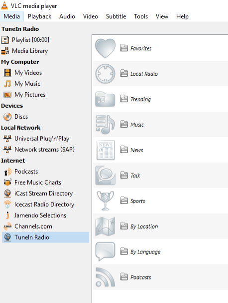

**Tunein-Radio-VLC**
====================

This is a Service Discovery LUA Script to TuneIn Radio for VLC 2.X.X and VLC 3.X.X

## Screenshots

# Installation

Download the latest release from: https://github.com/diegofn/TuneIn-Radio-VLC/archive/master.zip and uncompress it:

    curl -L https://github.com/diegofn/TuneIn-Radio-VLC/archive/master.zip > TuneinRadioVLC.zip
    unzip TuneinRadioVLC.zip

**Linux**: copy files to application directory:

    cp TuneIn-Radio-VLC-master/tunein.lua ~/.local/share/vlc/lua/sd/
    cp TuneIn-Radio-VLC-master/playlist/* ~/.local/share/vlc/lua/playlist/

if the destination directory does not exist, you can create using the `mkdir` command. 

**Windows**: open a Command Prompt as Administrator user and copy files to `C:\Program Files\VideoLAN\VLC\` for x86_64 version of VLC or to `%AppData%/VLC/VideoLAN/lua/sd` if it exists

    xcopy TuneIn-Radio-VLC-master\tunein.lua "C:\Program Files\VideoLAN\VLC\lua\sd"
    xcopy TuneIn-Radio-VLC-master\playlist\* "C:\Program Files\VideoLAN\VLC\lua\playlist"

**MacOS**: you can copy files to local `home` directory

    cp TuneIn-Radio-VLC-master/tunein.lua ~/Library/Application\ Support/org.videolan.vlc/lua/sd/
    cp -R TuneIn-Radio-VLC-master/playlist/* ~/Library/Application\ Support/org.videolan.vlc/lua/playlist/

**MacOS**: Alternatively, On MacOS you can copy files to `/Applications/VLC.app` folder to all users:

    sudo cp TuneIn-Radio-VLC-master/tunein.lua /Applications/VLC.app/Contents/MacOS/share/lua/sd/
    sudo cp -R TuneIn-Radio-VLC-master/playlist/* /Applications/VLC.app/Contents/MacOS/share/lua/playlist/

If you have an TuneIn user, you can modify the `tunein.lua` file in the __username__ and __password__ variables

Start your VLC

Click on `Internet` -> `TuneIn Radio`

Enjoy!

Version 0.7
===========
* Update script for VLC 3.X.X.
* Minor fix on Title and Author columns thanks to @umpirsky
* Fix identation thanks to @hbkfabio

Version 0.6
===========
* Update image hosting
* "My presets" change for "Favorites" category
* Minor fix

Version 0.5
===========
* Change PartnerId to support flash based streaming
* Update image URL

Version 0.4
===========
* Added Trending category

Version 0.3
===========
* Bug fixed about TuneIn Password
* Added StreamTheWorld Support
* Added radiotime.com playlist support to navigate podcast, sports, etc tree.

Version 0.2
===========
* Add music menu
* Add custom icon for main categories
* Run plugin as a LUA Object

Version 0.1
===========
* This is the first version, My Presets and Local Radio working
* The LUA Script mapping the Categories and Location nodes

# Project resources

- [Source code](https://github.com/diegofn/TuneIn-Radio-VLC)
- [Issue tracker](https://github.com/diegofn/TuneIn-Radio-VLC/issues>)

# Credits

- [Original author](https://github.com/diegofn)
- [Current maintainer](https://github.com/diegofn)
- [Contributors](https://github.com/diegofn/TuneIn-Radio-VLC/graphs/contributors)

# Wish List

- Read the username and password for the Preferences Dialog, In progress
- Be accepted in VLC git ;)
